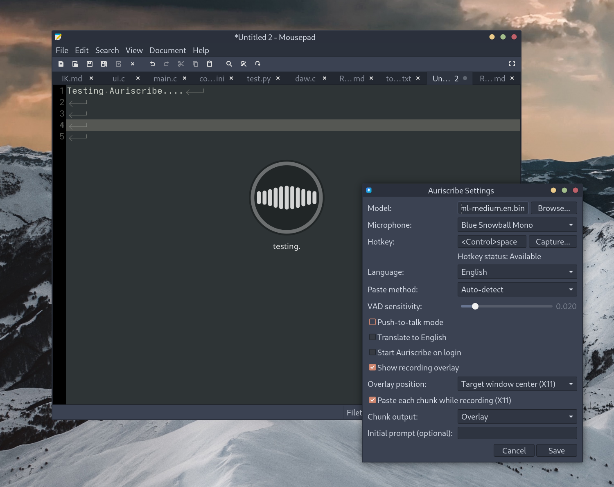

# Auriscribe

A lightweight, offline speech-to-text for Linux desktop use, built using whisper.cpp.



- Native application with no web tech or python
- Low memory usage, completely unloads the Whisper model when idle
- Vulkan backend by default for acceleration without pulling in lots of dependencies
- Optional voice activity animation that can be centered on the screen or over the window recieving input

## Install

### Debian/Ubuntu (.deb)

Download `auriscribe_*.deb` from the GitHub Releases page:

```bash
sudo dpkg -i ./auriscribe_*.deb
sudo apt-get -f install
```

### Fedora/RHEL (.rpm)

Download `auriscribe-*.rpm` from the GitHub Releases page:

```bash
sudo dnf install ./auriscribe-*.rpm
```

### Arch Linux (AUR)

- Package: `https://aur.archlinux.org/packages/auriscribe`

```bash
# Using an AUR helper
yay -S auriscribe

# Manual
git clone https://aur.archlinux.org/auriscribe.git
cd auriscribe
makepkg -si
```

## Building instructions

```bash
# Install build dependencies (Debian/Ubuntu helper)
make deps

# Build
make

# Run
./auriscribe
```

`make` builds the vendored `libs/whisper.cpp` automatically (Vulkan-enabled when available). `./scripts/setup-whisper.sh` is optional and only needed if you want to rebuild `libs/whisper.cpp` by itself.

## Download a Model

Use the tray menu: **Download Models...** → choose a model → **Download**.
Models are saved under `~/.local/share/auriscribe/models/` and the downloaded model is auto-selected.

## Usage

- Use the tray menu **Start/Stop Recording**.
- Configure a global hotkey in **Settings...** (some desktop environments reserve `Super` shortcuts).
- On stop, Auriscribe transcribes and inserts the text into the window that was active when recording started (X11).

Autostart: enable **Start Auriscribe on login** in Settings.

## Dependencies

- GTK3
- libayatana-appindicator3
- PulseAudio
- json-c
- libcurl
- X11 (for global hotkeys on X11)
- xdotool (for text input on X11)
- Optional (faster Whisper): Vulkan dev/runtime (e.g. `libvulkan-dev`)

## Performance knobs

- `AURISCRIBE_VULKAN=0` disables the Vulkan backend build (not recommended)
- `AURISCRIBE_REQUIRE_VULKAN=0` allows CPU-only builds (not recommended)
- `AURISCRIBE_NO_GPU=1` forces CPU at runtime
- `AURISCRIBE_GPU_DEVICE=0` selects GPU device index
- `AURISCRIBE_VULKAN_WARMUP=0` disables one-time Vulkan shader warmup on app startup
- `AURISCRIBE_THREADS=8` sets Whisper CPU thread count
- `AURISCRIBE_HF_REPO=ggerganov/whisper.cpp` overrides the Hugging Face model repo
- `AURISCRIBE_VK_ICD_FILENAMES=/path/to/icd.json` limits Vulkan ICD probing (can reduce one-time RAM overhead)

Legacy env vars (`XFCE_WHISPER_*`) are still accepted for backwards compatibility.

## Whisper initial prompt

In **Settings...** you can optionally set an **Initial prompt** (max 244 chars). This is passed to Whisper as an “initial prompt” to bias decoding (useful for names/jargon and consistent formatting).

Examples:
- Vocabulary / proper nouns: `Auriscribe, whisper.cpp, Vulkan, GGML, PipeWire, PulseAudio`
- Formatting: `Use proper punctuation. Use sentence case. Prefer numerals for numbers.`
- Domain bias: `Meeting notes. Action items. Technical discussion about Linux and GPUs.`

## Other Useful Projects

- Try my AI panel plugin for XFCE, [XFCE Ask](https://github.com/rabfulton/xfce-ask)
- For many more features try out [ChatGTK](https://github.com/rabfulton/ChatGTK)
